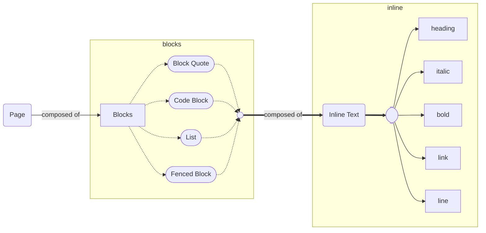
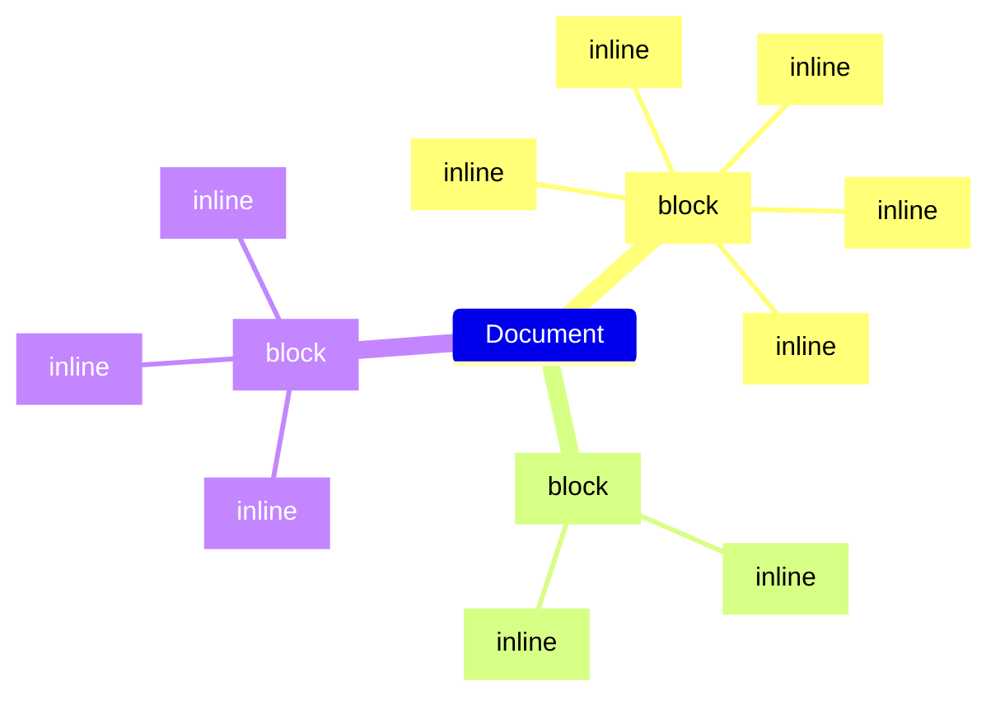

# Markdown

> [Commonmark Spec](https://spec.commonmark.org/0.30/)

## High Level Structure

Before creating the parser, it sometimes helps to think in pictures of high-level relationships:

This diagram is not meant to capture all of the rules/tokens/meaning found in a Markdown document but enough to help show the high-level relationships that a parser should be looking to reinforce.

Ultimately a parsed output of a Markdown page should resemble a tree structure something like the following:

This should give us a good start in our strategy for building out the parser.
